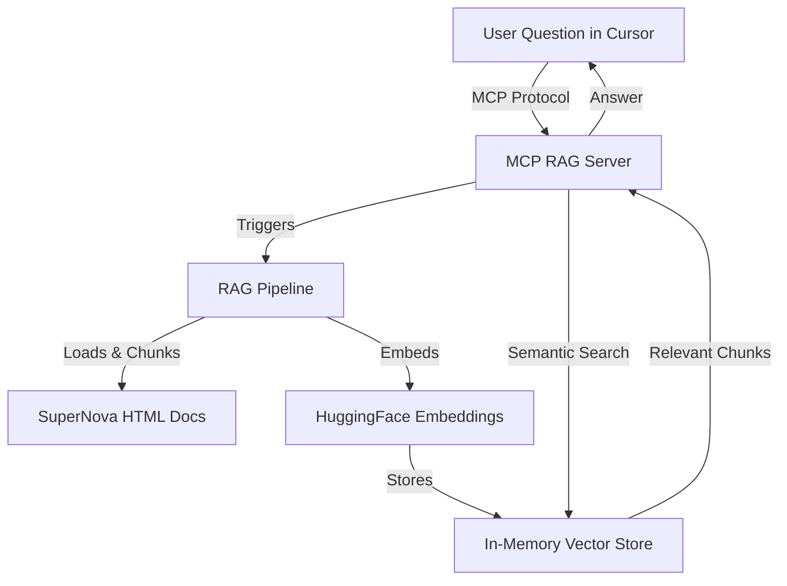

# SuperNova MCP RAG Monorepo

A monorepo demonstrating a Model Context Protocol (MCP) server with Retrieval-Augmented Generation (RAG) for answering questions about imaginary SuperNova documentation.

- The documentation is an imaginary product documentation. It is a collection of HTML files with AI generated content.
- The documentation is processed into chunks and stored in a vector database.
- The server is built with Node.js and uses free HuggingFace embeddings for semantic search.

Accompanying blog post: [Building a MCP RAG Server: Enhancing Developer Tools with Contextual Documentation Search](https://codewithshabib.com/building-a-mcp-rag-server-enhancing-developer-tools-with-contextual-documentation-search/)

## Architecture Overview



## Monorepo Structure

- `mcp-rag-server/` — MCP server with RAG pipeline (Node.js, TypeScript)
- `monorepo-sample-package/` — Sample package (for monorepo demonstration)
- `docs/` — Dummy HTML documentation for SuperNovaStorybook-Mobile-Swift

## Quick Start

### Prerequisites

- Node.js 18+
- Yarn (for workspace support)

### Install Dependencies

```bash
yarn install
```

### Environment Setup

Create a `.env` file in `mcp-rag-server/`:

```
HUGGINGFACE_API_KEY=your_huggingface_token_here
```

### Build & Run MCP RAG Server

```bash
#install
yarn install
#list workspace

yarn workspaces info

# Build
yarn workspace mcp-rag-server build

# Start
yarn workspace mcp-rag-server start
```

- For development (hot-reload):
  ```bash
  yarn dev
  ```

> Note: The server might take a while to prepare the vector store. You can see the progress in the logs.

## How It Works

- **MCP Protocol:** Exposes a tool (`search_docs`) for semantic search over documentation.
- **RAG Pipeline:**
  - Loads and parses `docs/SuperNovaStorybook-Mobile-Swift/*.html`, i.e. all the HTML files in that directory.
  - Splits text into chunks
  - Embeds chunks using HuggingFace Inference API
  - Stores in an in-memory vector store (LangChain)
  - Answers queries by semantic similarity search

## Usage with Cursor

1. Open Cursor
2. Add a new MCP server in Settings → MCP:
   - Type: MCP (Stdio)
   - Command: `node` (from `mcp-rag-server`)
   - Arguments: `/absolute-path-to/supernova-mcp-rag/mcp-rag-server/dist/index.js`
   - Ensure `.env` is set up with your HuggingFace API key
3. Ask questions about the SuperNova documentation in Cursor chat

### Sample mcp.json

```json
{
  "mcpServers": {
    "mcp-rag-server": {
      "command": "node",
      "args": [
        "/absolute-path-to/supernova-mcp-rag/mcp-rag-server/dist/index.js"
      ],
      "disabled": false,
      "autoApprove": []
    }
  }
}
```


## Debugging with MCP Inspector and Simple Browser

The **MCP Inspector** is an interactive developer tool designed to help you test and debug your MCP server in real time.

### How to Use MCP Inspector

1. **Start your MCP server locally.**

2. **Run the Inspector with your server from the root of the monorepo:**

```bash
npx @modelcontextprotocol/inspector node mcp-rag-server/dist/index.js
```

3. **Open the Inspector Web UI:**

The Inspector will print a URL such as: `http://127.0.0.1:6274/`

4. **Open this URL in the VS Code Simple Browser or any web browser:**

- In Cursor / VS Code, open the Command Palette (`Ctrl+Shift+P` or `Cmd+Shift+P`), type `Simple Browser: Show`, and enter the URL.
- Alternatively, open the URL in Chrome, Firefox, or any browser.

5. **Interact with your MCP server:**

- Send test queries.
- Inspect tool calls and responses.
- Debug and verify your MCP server’s behavior live.

### Why Use Simple Browser?

- Some browsers (like Safari) may block HTTP requests due to HTTPS-only mode.
- VS Code’s Simple Browser avoids such restrictions and is convenient for local development.


Using the MCP Inspector with the Simple Browser is a powerful way to debug and validate your MCP server before integrating it fully with clients like Cursor.

---

## Troubleshooting

- Ensure your HuggingFace API key is valid and not rate-limited
- If the server fails to start, check `.env` and logs
- For dependency issues, use `yarn install` from the root

## Performance Considerations & Limitations

How the Current Implementation Works

- All HTML files in the documentation folder (and subfolders) are recursively discovered and processed.
- Each HTML file is parsed, its text extracted, and then split into overlapping chunks for semantic search.
- Embeddings for each chunk are generated using the Hugging Face Inference API.
- All embeddings are stored in an in-memory vector store for fast retrieval during queries.

### Performance Choices

- In-Memory Vector Store:
  Fast for small to medium documentation sets, with zero external dependencies, but not suitable for very large corpora due to memory constraints.
- On-the-Fly Embedding:
  Embeddings are generated at server startup for all chunks. This makes initial startup slower, but ensures all content is searchable.
- Sequential Processing:
  Files and embeddings are processed one after another for simplicity and reliability.

### Limitations

- Startup Time:
  The server will take longer to start as the documentation set grows, since all files must be processed and embedded before queries can be served.
- Hugging Face API Rate Limits:
  Embedding many chunks can quickly hit the free-tier API rate limits (see Hugging Face API Pricing & Limits). You may encounter delays or errors if you exceed your quota.
- Memory Usage:
  The in-memory vector store is not suitable for large documentation sets or production-scale deployments.
- No Persistent Indexing:
  The vector store is rebuilt from scratch every time the server restarts; there is no caching or persistent index.
- Single-Threaded Processing:
  All processing is currently sequential. For large numbers of files, parallel or batched processing could improve performance, but would require careful handling of API limits and error cases.

#### Hugging Face API Usage & Limits

- The Hugging Face Inference API has a free tier with request limits (e.g., 300 requests/hour for registered users).
- See [API Pricing & Rate Limits](https://huggingface.co/docs/api-inference/en/pricing) and [Supported Models](https://huggingface.co/docs/api-inference/index) for details.
- If you exceed your quota, you may receive 429 errors or have to wait for your quota to reset.

### Possible Improvements

- Batch or Parallel Embedding:
  Where supported, batching embedding requests or processing files in parallel can speed up initialization.
- Persistent or External Vector Database:
  For large-scale or production use, consider using langchain's vector store interface to store the embeddings in a persistent vector database such as Pinecone, Weaviate, or Qdrant.
- Preprocessing Step:
  Move the embedding and indexing process to a separate build step to avoid long server startup times.
- Streaming Initialization:
  Serve queries as soon as parts of the vector store are ready, rather than waiting for all files to be processed.
- You can also utilize langchain's api to have your own llm pipeline. That way you can use any llm you want as well as have control over response temperature, max tokens, etc.

## License

This project is licensed under the MIT License - see the [LICENSE](LICENSE) file for details.
